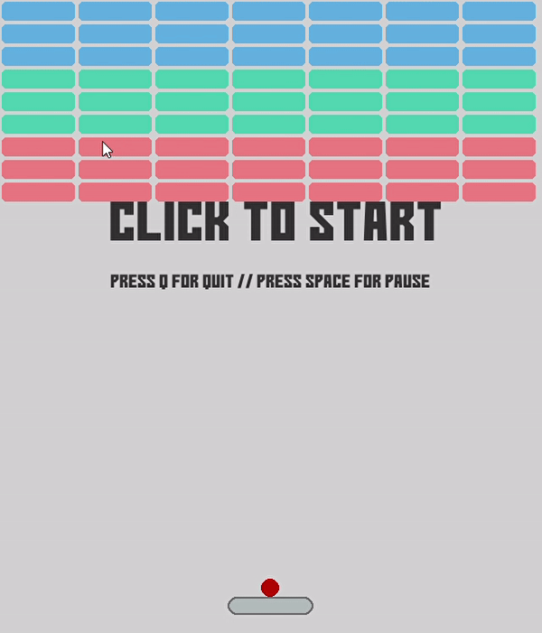

# Bricky

Este projeto é um jogo desenvolvido com Python e Pygame, onde o objetivo é destruir uma parede de tijolos com uma bola controlada por uma raquete.

## Visão Geral

Bem-vindo ao Bricky! Ele é um jogo dinâmico onde você controla uma raquete para rebater uma bola que deve destruir todos os tijolos na tela. Use as setas do teclado para mover a raquete e evitar que a bola caia.

## Como Funciona

O jogo começa com uma parede de tijolos de diferentes resistências. Você deve mover a raquete para rebater a bola, que irá destruir os tijolos ao colidir com eles. O jogo termina quando todos os tijolos são destruídos ou quando a bola cai fora da tela.

## Como Usar

1. Clone o repositório para sua máquina local.
2. Certifique-se de ter o Python e o Pygame instalados.
3. Execute o script do jogo.

```bash
python bricky.py
```

4. Use as setas do teclado para mover a raquete e rebater a bola.

## Requisitos

- Python 3.x instalado em sua máquina.
- Pygame instalado.
  
```bash
pip install pygame
```

## Preview



## Resultados

O objetivo do jogo é destruir todos os tijolos na tela. A pontuação é calculada com base nos tijolos destruídos.

### Controles:

- **Seta Esquerda:** Move a raquete para a esquerda.
- **Seta Direita:** Move a raquete para a direita.
- **Espaço:** Pausa a jogo.
- **Q:** Sai do jogo.

### Elementos do Jogo:

- **Raquete:** Controlada pelo jogador para rebater a bola.
- **Bola:** Deve ser rebatida pela raquete para destruir os tijolos.
- **Tijolos:** Diferentes cores indicam diferentes resistências.

## Contribuição

Sinta-se à vontade para contribuir para este projeto fornecendo sugestões, relatando problemas ou enviando pull requests. Divirta-se jogando e melhorando o Bricky!

## Licença

Este projeto está licenciado sob a Licença MIT. Veja o arquivo LICENSE para mais detalhes.

---

Divirta-se jogando Bricky e aprimorando suas habilidades de programação e jogo!
